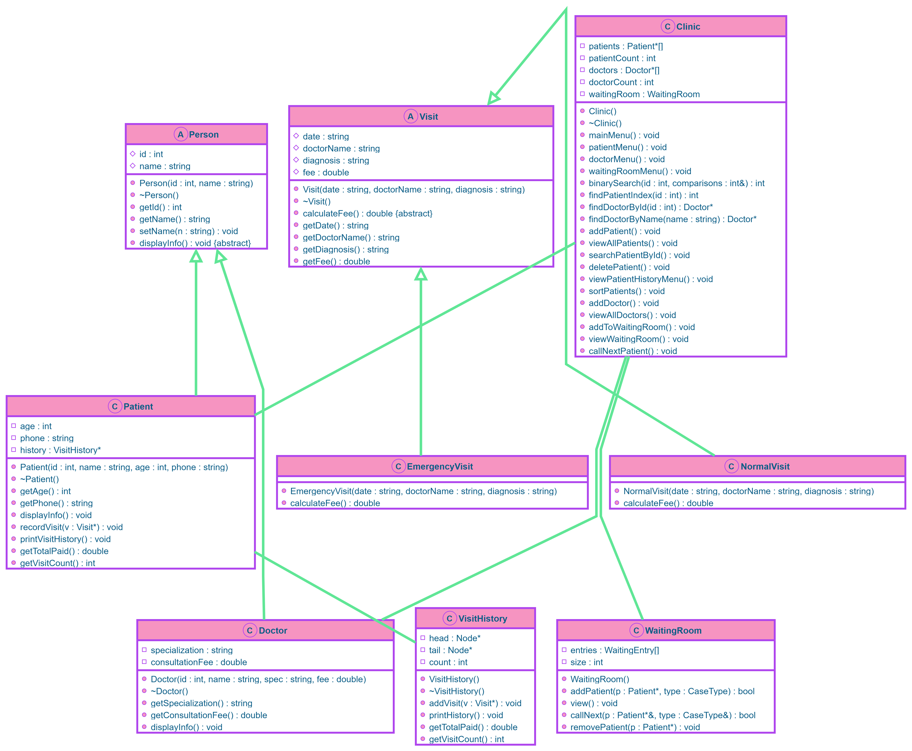
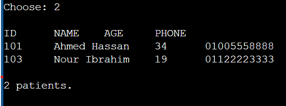
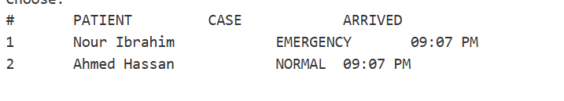
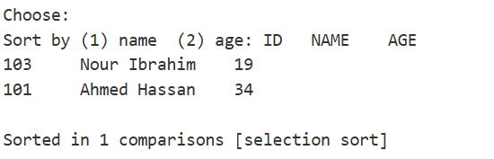

# Clinic Management System

A C++ console application that manages a small clinic's patients, doctors, and waiting room, manages today's waiting room using a priority queue, and records each visit. Emergency cases are prioritized over normal cases.

## Team Members
- Doha Gamal - All parts

## How to compile and run
g++ src/*.cpp -I include -o clinic
./clinic

## UML Class Diagram

## Data Structures Used
- Priority Queue (Waiting Room): Built from scratch using an array. Emergency cases jump the queue.
- Linked List (Visit History): Built from scratch for each patient's visit history.

## Big O Table

| Operation | Structure | Time |
|-----------|-----------|------|
| Search by ID | Sorted Array (Binary Search) | O(log n) |
| Sort Patients | Array (Selection Sort) | O(n²) |
| Call Next Patient | Priority Queue | O(n) |
| Add Visit | Linked List | O(1) |
| Total Paid (Recursive) | Linked List | O(n) |

## Screenshots

